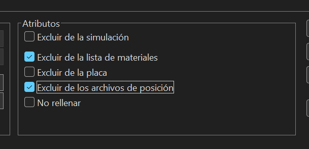
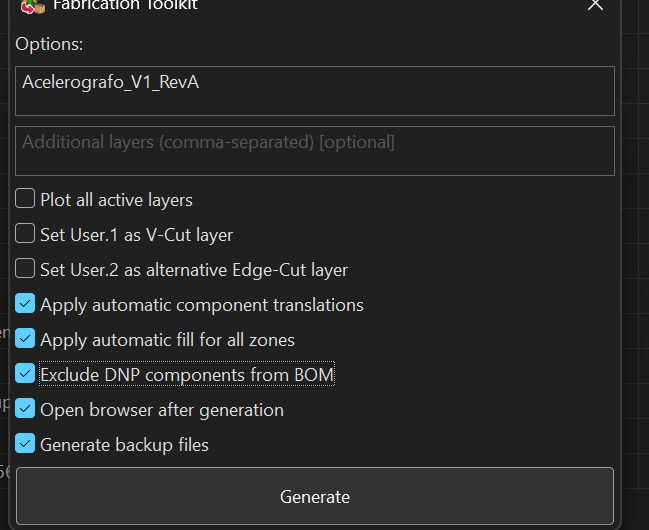

# Proyecto Nodo

## Migración y preparación para fabricación PCBA en KiCad 10

## Introducción

El presente documento describe el procedimiento utilizado para migrar el **Proyecto Nodo** desde Altium Designer hacia **KiCad 10**, estandarizar las bibliotecas empleadas durante el desarrollo y preparar el diseño para su fabricación y ensamblaje automático mediante el servicio **PCBA de JLCPCB**. El objetivo principal es que cualquier desarrollador pueda clonar el repositorio, configurar el entorno de trabajo y generar nuevamente los archivos de fabricación sin depender de configuraciones locales ni de software propietario.

Durante el proceso de migración se realizó la importación del diseño electrónico, la actualización de componentes de montaje superficial, la organización de bibliotecas locales, la asignación de códigos LCSC para los componentes compatibles con JLCPCB y la generación automática de símbolos, huellas y modelos tridimensionales mediante herramientas auxiliares. Finalmente, se validó el proyecto utilizando las herramientas de fabricación de KiCad para obtener los archivos requeridos por el servicio de ensamblaje.

Toda la estructura del proyecto fue diseñada para mantener una organización uniforme dentro del repositorio Git, evitando referencias a bibliotecas externas y garantizando que todos los recursos necesarios para abrir el proyecto se encuentren almacenados localmente.

---

# Estructura del proyecto

El repositorio se organiza siguiendo una estructura modular que separa la documentación, los diseños electrónicos, las bibliotecas, el firmware y los archivos de producción. Esta organización facilita el mantenimiento del proyecto y permite reutilizar las bibliotecas en otros diseños desarrollados dentro del mismo repositorio.

```text
RSA-Intern-SHM/
│
├── Docs/
│   └── Nodo/
│       └── README.md
│
├── KiCad/
│   ├── libs/
│   │   ├── RSA.kicad_sym
│   │   ├── RSA.pretty/
│   │   │   ├── *.kicad_mod
│   │   │   └── packages3d/
│   │   └── LibExt.pretty/
│   │
│   └── projects/
│       └── Nodo/
│
├── Firmware/
│
└── Production/
```

La carpeta **KiCad/libs** almacena todas las bibliotecas utilizadas por el proyecto. En ella se encuentran los símbolos eléctricos, las huellas de PCB y los modelos tridimensionales descargados automáticamente desde JLCPCB o desarrollados manualmente. Gracias a esta organización, cualquier persona que clone el repositorio dispondrá inmediatamente de todos los recursos necesarios para abrir el proyecto sin realizar configuraciones adicionales.

---

# Configuración del entorno

Antes de comenzar la migración es necesario preparar el entorno de desarrollo. La herramienta principal utilizada durante todo el proceso es **KiCad 10**, la cual proporciona las utilidades necesarias para editar esquemáticos, diseñar tarjetas PCB, administrar bibliotecas y generar los archivos de fabricación. Se recomienda instalar la versión estable más reciente disponible para asegurar la compatibilidad con los formatos utilizados en este proyecto.

Como complemento, se emplea **Python 3.14** para ejecutar herramientas auxiliares destinadas a la descarga automática de bibliotecas electrónicas. Se recomienda crear un entorno virtual con el fin de aislar las dependencias del proyecto y evitar conflictos con otras aplicaciones instaladas en el sistema. Para ello puede ejecutarse el siguiente comando:

```powershell
python -m venv .venv
```

Una vez creado el entorno virtual, este debe activarse antes de instalar las dependencias necesarias.

```powershell
.venv\Scripts\activate
```

Posteriormente se recomienda actualizar el administrador de paquetes para garantizar la instalación de las versiones más recientes de cada dependencia.

```powershell
pip install --upgrade pip
```

Con el entorno preparado, se procede a instalar **JLC2KiCadLib**, una utilidad desarrollada para descargar automáticamente los símbolos eléctricos, footprints y modelos tridimensionales disponibles en la base de datos de JLCPCB a partir del código LCSC de cada componente. Esta herramienta simplifica considerablemente la creación de bibliotecas y reduce el tiempo requerido para preparar nuevos diseños.

Las dependencias pueden instalarse mediante los siguientes comandos:

```powershell
pip install kicadmodtree requests
pip install JLC2KiCadLib
```

Finalmente, es recomendable verificar que la instalación se haya realizado correctamente ejecutando:

```powershell
JLC2KiCadLib --help
```

Además de las herramientas anteriores, este proyecto utiliza el complemento **Fabrication Toolkit**, disponible desde el **Plugin and Content Manager (PCM)** de KiCad. Este complemento permite automatizar la generación de la lista de materiales (BOM), el archivo de posicionamiento de componentes (CPL), los archivos Gerber y el archivo de perforaciones (NC Drill), todos ellos compatibles con el proceso de fabricación y ensamblaje de JLCPCB. Una vez instalado el complemento, únicamente es necesario reiniciar KiCad para disponer de todas sus funcionalidades.

---

# Configuración de KiCad

Con el entorno completamente instalado, el siguiente paso consiste en registrar las bibliotecas locales utilizadas por el proyecto. A diferencia de otros flujos de trabajo donde las bibliotecas se instalan globalmente, en este proyecto todos los símbolos, footprints y modelos tridimensionales permanecen dentro del repositorio. Esta estrategia garantiza que cualquier modificación realizada sobre una biblioteca quede versionada junto con el resto del proyecto y evita incompatibilidades entre diferentes estaciones de trabajo.

En el administrador de bibliotecas de símbolos (**Preferences → Manage Symbol Libraries**) debe agregarse el archivo **RSA.kicad_sym**, ubicado dentro de la carpeta **KiCad/libs**. De forma similar, desde **Preferences → Manage Footprint Libraries** debe registrarse la biblioteca **RSA.pretty**, la cual contiene todas las huellas utilizadas por el diseño.

Para evitar referencias a rutas absolutas, también se recomienda definir la variable de entorno **RSA_LIBS**, apuntando al directorio **KiCad/libs**. Gracias a esta configuración, los modelos tridimensionales podrán localizarse utilizando rutas relativas como:

```text
${RSA_LIBS}/RSA.pretty/packages3d/
```

El uso de variables de entorno facilita la portabilidad del proyecto y evita que las referencias a modelos 3D deban modificarse cuando el repositorio es clonado en un nuevo equipo. De esta forma, el proyecto mantiene una estructura consistente y completamente independiente de la ubicación física donde haya sido almacenado.

---

# Migración del proyecto

Una vez configurado el entorno de desarrollo, se procede a importar el proyecto originalmente desarrollado en Altium Designer hacia KiCad 10. Durante esta etapa es importante verificar que tanto el esquemático como el diseño de la tarjeta de circuito impreso hayan sido convertidos correctamente, prestando especial atención a las referencias entre componentes, nombres de redes, jerarquías y asociaciones entre símbolos y huellas.

Aunque KiCad incorpora herramientas de importación compatibles con proyectos de Altium, es recomendable realizar una revisión completa del diseño una vez finalizada la conversión. En particular, deben verificarse las conexiones eléctricas, las reglas de diseño (DRC), la orientación de los componentes y la correcta asociación de cada símbolo con su respectiva huella. Esta revisión permite detectar posibles inconsistencias derivadas del proceso de conversión antes de continuar con la preparación para fabricación.

Durante la migración también se reorganizaron las bibliotecas del proyecto con el propósito de eliminar dependencias externas. Los símbolos y footprints que originalmente pertenecían a bibliotecas globales fueron reemplazados por versiones almacenadas dentro de la carpeta `KiCad/libs`, garantizando que el proyecto permanezca completamente autocontenido y pueda abrirse correctamente en cualquier equipo.

---

# Adaptación de componentes para ensamblaje PCBA

Con el proyecto ya migrado, el siguiente paso consiste en adaptar los componentes para que puedan ser ensamblados automáticamente por JLCPCB. Aunque muchos componentes utilizados originalmente poseen versiones de montaje superficial (SMD), algunos dispositivos fueron reemplazados por equivalentes compatibles con el proceso de ensamblaje automático, mientras que otros permanecieron como componentes de inserción (THT) debido a restricciones mecánicas o de disponibilidad.

Cada componente fue revisado individualmente para verificar la existencia de un código **LCSC**, ya que este identificador permite relacionar el diseño electrónico con la base de datos de componentes disponible en JLCPCB. En aquellos casos donde existía un reemplazo SMD funcionalmente equivalente, se actualizó el esquemático y el PCB para utilizar dicho componente. Cuando no existía una alternativa adecuada, el componente se mantuvo como montaje manual y se excluyó del proceso de ensamblaje automático.

Este procedimiento permitió maximizar la cantidad de componentes ensamblados durante la fabricación, reduciendo considerablemente el trabajo de soldadura manual posterior.

---

# Gestión de bibliotecas y componentes

Con la selección definitiva de componentes realizada, fue necesario organizar las bibliotecas utilizadas por el proyecto. Para ello se decidió centralizar todos los recursos dentro de una única biblioteca denominada **RSA**, donde se almacenan los símbolos eléctricos, footprints y modelos tridimensionales descargados desde JLCPCB.

La descarga automática de estos recursos se realizó mediante la herramienta **JLC2KiCadLib**, la cual utiliza el código LCSC de cada componente para obtener la información necesaria desde la base de datos oficial de JLCPCB. Gracias a este procedimiento fue posible generar bibliotecas consistentes y reutilizables sin necesidad de construir manualmente cada footprint o símbolo.

El comando utilizado para descargar las bibliotecas del proyecto fue el siguiente:

```powershell
& "$env:APPDATA\Python\Python314\Scripts\JLC2KiCadLib.exe" `
C481667 `
C2651511 `
C35879 `
C720477 `
C4410 `
C17902 `
C26010 `
C17900 `
C17936 `
C2290 `
C2128 `
C1525 `
C29266 `
C15195 `
C970695 `
C2858857 `
C70381 `
-dir "C:\Users\Suarezc1224\Desktop\RSA-Intern-SHM\KiCad\libs" `
-symbol_lib RSA `
-symbol_lib_dir . `
-footprint_lib RSA.pretty `
-model_dir packages3d `
--skip_existing
```

La ejecución de este comando genera automáticamente el archivo `RSA.kicad_sym`, la biblioteca de footprints `RSA.pretty` y la carpeta `packages3d`, donde se almacenan los modelos tridimensionales utilizados por el visualizador 3D de KiCad.

Una vez descargadas las bibliotecas, se recomienda revisar cada componente para verificar que tanto el símbolo como la huella y el modelo tridimensional hayan sido asociados correctamente. En algunos casos puede ser necesario ajustar manualmente la orientación del modelo 3D o reemplazar la huella por otra versión más adecuada al diseño de la tarjeta.

---

# Componentes utilizados

Los componentes empleados durante el desarrollo del Proyecto Nodo fueron seleccionados priorizando su disponibilidad dentro del catálogo de JLCPCB y la compatibilidad con el proceso de ensamblaje automático. Para cada componente se registró su código LCSC, fabricante, encapsulado y huella correspondiente dentro de KiCad, permitiendo automatizar la generación de la lista de materiales durante la fabricación.

| Componente | Voltaje | JLCPCB | Type | Package | Footprint | Name |
| --- | --- | --- | --- | --- | --- | --- |
| 7805 | 12V>5V | C15077 | Extended | TO-263-2 | Package_TO_SOT_SMD:TO-263-2 | U6  |
| C_470uF | 16V | C2858857 | Extended | SMD,D8xL10.2mm | Capacitor_SMD:C_Elec_8x10.2 | C1  |
| C_220uF | 16V | C970695 | Extended | SMD,D6.3xL7.7mm | Capacitor_SMD:C_Elec_6.3x7.7 | C3  |
| C_100nF | 16V | C1525 | Basic | 0402 | Capacitor_SMD:C_0402_1005Metric | C2,C5,C4,C7,C8,C11,C13,C16 |
| C_10nF | 16V | C15195 | Basic | 0402 | Capacitor_SMD:C_0402_1005Metric | C6,C9 |
| C_1uF | 16V | C29266 | Extended | 0402 | Capacitor_SMD:C_0402_1005Metric | C10 |
| R_1k | Res_250mW | C4410 | Basic | 1206 | Resistor_SMD:R_1206_3216Metric | R6  |
| R_3.3k | Res_125mW | C26010 | Basic | 0805 | Resistor_SMD:R_1206_3216Metric | R1,R2,R13,R14 |
| R_4.7k | Res_250mW | C17936 | Basic | 1206 | Resistor_SMD:R_1206_3216Metric | R3  |
| R_10k | Res_250mW | C17902 | Basic | 1206 | Resistor_SMD:R_1206_3216Metric | R4  |
| D_1n4148 | 1N4148WS | C2128 | Basic | SOD-323 | Diode_SMD:D_SOD-323 | D1  |
| D_led_white | 2.6V~3.1V 360mcd 5mA | C2290 | Basic | 0603 | LED_SMD:LED_0603_1608Metric | D3  |
| MAX485ED | MAX485 | C481667 | Extended | SOP-8 | Package_SO:SOIC-8_3.9x4.9mm_P1.27mm | U5,U9 |
| LD1117S33CTR | LD33 | C35879 | Extended | SOT-223-4SOT-223-4 | Package_TO_SOT_SMD:SOT-223-3_TabPin2 | U3  |
| LM1117DT | LM1117DT-5.0/NOPB | C354068 | Extended | TO-252 | Package_TO_SOT_SMD:TO-252-3_TabPin2 | U2  |

La utilización de códigos LCSC simplifica el proceso de fabricación, ya que JLCPCB puede identificar automáticamente cada componente durante la generación de la orden de ensamblaje, reduciendo errores y evitando la selección manual de referencias equivalentes.

---

# Componentes sin código LCSC

No todos los dispositivos presentes en el proyecto forman parte del catálogo de componentes de JLCPCB. Algunos elementos corresponden a conectores, microcontroladores especializados o componentes mecánicos que deben instalarse manualmente una vez recibida la tarjeta ensamblada.

Estos componentes permanecen dentro del esquemático y del diseño PCB, pero no participan en el proceso automático de ensamblaje.

| Componente | Observación |
|------------|-------------|
| dsPIC33EP256MC202 | Instalación manual |
| Pin Header 2x20 | Instalación manual |
| Pin Header 1x02 | Instalación manual |
| Conector RJ45 | Instalación manual |

La exclusión de estos dispositivos del proceso de ensamblaje no afecta la generación de la lista de materiales, siempre que se encuentren correctamente configurados mediante los campos correspondientes dentro del esquemático.


---

# Configuración de los campos del esquemático

Antes de generar los archivos de fabricación es recomendable revisar los campos asociados a cada componente del esquemático. Durante la migración desde Altium es habitual que se conserven propiedades provenientes de diferentes proveedores o herramientas de simulación que no aportan información relevante para el proceso de fabricación. Mantener únicamente los campos necesarios simplifica el mantenimiento del proyecto, evita información duplicada y facilita la generación de la lista de materiales.

Para este proyecto se conservaron únicamente los campos requeridos por KiCad, por el proceso de ensamblaje de JLCPCB y por las herramientas de simulación integradas. En consecuencia, cada componente debe contener únicamente los siguientes campos:

| Campo | Descripción |
|--------|-------------|
| Reference | Identificador del componente. |
| Value | Valor o referencia comercial del componente. |
| Footprint | Huella utilizada en el PCB. |
| Datasheet | Hoja de datos del fabricante. |
| Description | Descripción del componente. |
| Qty | Cantidad utilizada en el proyecto. |
| # | Número de referencia interno. |
| LCSC | Código del componente en JLCPCB. |
| MANUFACTURER | Fabricante del componente. |
| MANUFACTURER_PART_NUMBER | Número de parte del fabricante. |
| PACKAGE | Encapsulado físico. |
| Sim.Device | Configuración de simulación. |
| Sim.Pins | Asociación de pines para simulación. |
| Sim.Type | Tipo de dispositivo para simulación. |
| DNP | Indica si el componente no debe ensamblarse. |
| Exclude from BOM | Excluye el componente de la lista de materiales. |
| Exclude from Board | Excluye el componente del PCB. |

Todos los demás campos, especialmente aquellos relacionados con distribuidores externos como Digi-Key, Mouser, Farnell, Newark, Purchase URL o referencias equivalentes, fueron eliminados para mantener una estructura uniforme en todo el proyecto. Esta limpieza facilita la edición del esquemático y evita inconsistencias durante la generación automática de la documentación de fabricación.

> **Nota:** Se recomienda incluir en esta sección la captura de pantalla correspondiente a la configuración de campos utilizada durante el desarrollo del proyecto.

---

# Generación de archivos de fabricación

Una vez verificado el esquemático y completada la asignación de códigos LCSC, el proyecto se encuentra listo para generar la documentación necesaria para fabricación y ensamblaje. Para ello se emplea el complemento **Fabrication Toolkit**, integrado en KiCad, el cual automatiza la generación de todos los archivos requeridos por JLCPCB. Antes de ello es importante excluir los elementos necesarios de los archivos de producción dentro de las propiedades del elemento.


Desde el editor de PCB se ejecuta el complemento y se selecciona el fabricante **JLCPCB** como destino. A continuación se generan de forma automática los archivos Gerber, el archivo de perforaciones (NC Drill), la lista de materiales (BOM) y el archivo de posicionamiento de componentes (CPL). El uso de esta herramienta garantiza que todos los archivos sean compatibles con el formato esperado por el servicio de fabricación, reduciendo significativamente la posibilidad de errores derivados de configuraciones manuales.

Una vez generados los archivos, se recomienda almacenarlos dentro de la carpeta `Production` del repositorio. De esta manera, toda la documentación relacionada con la fabricación permanece organizada y puede recuperarse fácilmente para futuras revisiones o nuevas órdenes de producción.



---

# Validación en JLCPCB

Antes de enviar el diseño a fabricación es recomendable realizar una validación completa utilizando el visor web de JLCPCB. Durante esta etapa se verifica que todos los componentes reconocidos mediante el código LCSC aparezcan correctamente asociados y que las orientaciones indicadas en el archivo CPL coincidan con la disposición física del PCB.

Asimismo, deben revisarse cuidadosamente las capas del diseño, el contorno de la tarjeta, los orificios de montaje, las dimensiones generales y cualquier advertencia generada por la plataforma de fabricación. En caso de detectarse componentes con orientación incorrecta, estos pueden corregirse directamente en KiCad y volver a generar el archivo CPL sin necesidad de modificar el resto de la documentación.

Esta validación constituye el último paso antes de confirmar la orden de fabricación y permite reducir considerablemente la probabilidad de errores durante el ensamblaje automático.

---

# Buenas prácticas

Durante el desarrollo del proyecto se adoptaron una serie de prácticas orientadas a facilitar el mantenimiento del repositorio y garantizar la reproducibilidad del diseño. Todas las bibliotecas utilizadas se almacenan localmente dentro del repositorio, evitando dependencias con bibliotecas instaladas en el sistema operativo. De igual forma, se emplean variables de entorno para referenciar los modelos tridimensionales, permitiendo que el proyecto pueda abrirse correctamente desde cualquier ubicación sin modificar rutas internas.

Se recomienda mantener actualizadas las bibliotecas únicamente cuando sea necesario incorporar nuevos componentes y evitar modificar las huellas descargadas automáticamente, salvo que exista una justificación técnica. En caso de requerir modificaciones específicas, es preferible crear una copia dentro de la biblioteca local para preservar la integridad de los componentes originales.

Finalmente, antes de cada liberación del proyecto, es aconsejable ejecutar las verificaciones ERC y DRC de KiCad, comprobar la correspondencia entre el esquemático y el PCB, revisar la lista de materiales generada y validar nuevamente los archivos de fabricación mediante el visor de JLCPCB.